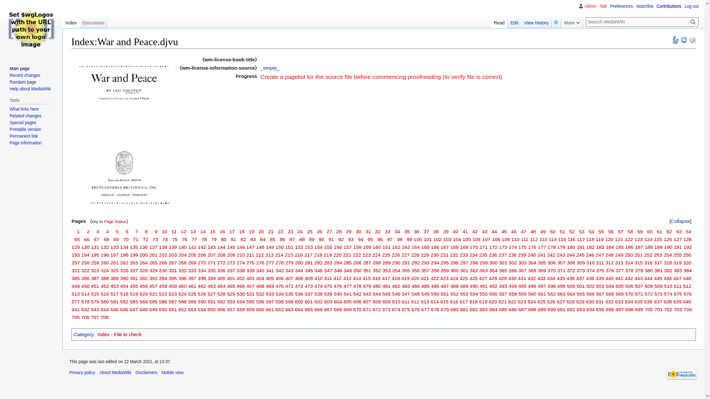

# ProofreadPage

## Setup

To install ProofreadPage in MediaWiki-Docker the following steps need to be done:

* Clone the ProofreadPage repository into ```mediawiki/extensions/ProofreadPage``` (Command should be something like ```
git clone "https://gerrit.wikimedia.org/r/mediawiki/extensions/ProofreadPage" ProofreadPage```)

* Clone the ParserFunctions repository into ```mediawiki/extensions/ParserFunctions``` (Command should be something like ```
git clone "https://gerrit.wikimedia.org/r/mediawiki/extensions/ParserFunctions" ParserFunctions```)

* Run ```docker-compose exec -u 0 mediawiki bash -c 'apt update && apt install djvulibre-bin netpbm'```

* Add the following text to the end of `mediawiki/LocalSettings.php`: (skip this step if you have done this before)

```php
wfLoadExtension( 'ProofreadPage' );
wfLoadExtension( 'ParserFunctions' );
$wgFileExtensions[] = 'djvu';
$wgDjvuDump = "djvudump";
$wgDjvuRenderer = "ddjvu";
$wgDjvuTxt = "djvutxt";
$wgDjvuPostProcessor = "pnmtojpeg";
$wgDjvuOutputExtension = 'jpg';
```

* Download [```Wikisource-20210103174144.xml```](./Wikisource-20210103174144.xml) file (inside this repository) into the ```mediawiki/``` directory (make sure the file is named ```Wikisource-20210103174144.xml```)

* Run ```docker-compose exec -u 0 mediawiki bash -c 'php maintenance/importDump.php < ./Wikisource-20210103174144.xml'```

* Run ```docker-compose exec -u 0 mediawiki bash -c 'php maintenance/rebuildrecentchanges.php'```

* Run ```docker-compose exec -u 0 mediawiki bash -c 'php maintenance/initSiteStats.php'```

* Delete ```Wikisource-20210103174144.xml```

## Testing (to see if ProofreadPage works)

* Add ```$wgUseInstantCommons = true;``` to your ```mediawiki/LocalSettings.php```.

* Navigate to http://localhost:8080/wiki/Index:War_and_Peace.djvu and click ```edit``` (or ```Create Source```) followed by ```Save Changes```.

* Check if the page looks like

